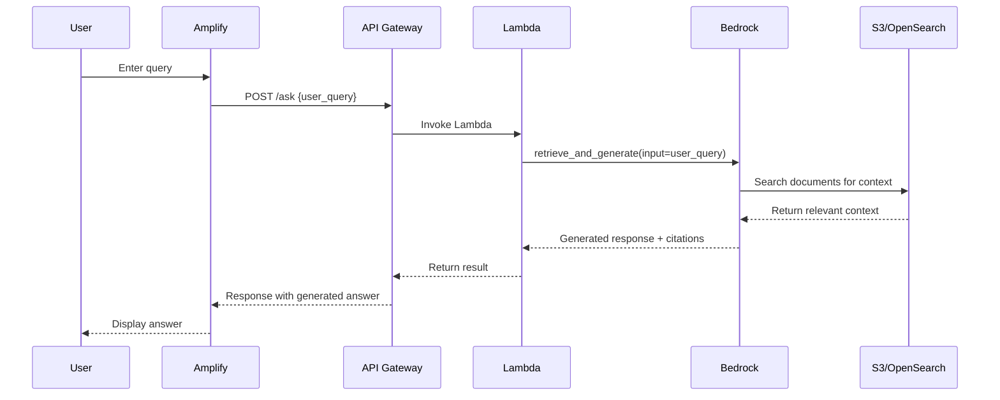

# AWS-RAG-Based-Chatbot
# 📚 AWS Bedrock RAG Chatbot with Lambda & API Gateway

This project implements a **Retrieval-Augmented Generation (RAG)** chatbot using **Amazon Bedrock**, **Claude V2**, and **serverless AWS infrastructure** (Lambda + API Gateway + Amplify + S3 + OpenSearch). It allows users to ask questions through a frontend interface, and receive intelligent responses grounded in a knowledge base stored in Amazon S3.

---

## 🔧 Architecture Overview



---

## 💡 Features

- 🔎 Retrieval-Augmented Generation using Claude V2
- 📄 Knowledge Base from S3 documents with OpenSearch vector indexing
- ☁️ Fully serverless: Lambda + API Gateway
- 💬 Frontend powered by AWS Amplify
- 🔐 Environment-secure using AWS Secrets and IAM
- ✅ Graceful fallback when no documents match

---

## 📁 Project Structure

```
📦 bedrock-rag-chatbot/
├── lambda_function.py       # Main Lambda handler for Bedrock interaction
├── README.md                # You're reading it!
├── amplify-frontend/        # (Optional) Frontend UI
└── documents/               # Upload these to S3 for knowledge base
```

---

## 🚀 How It Works

1. **User** enters a query on the Amplify frontend.
2. The query is sent to **API Gateway**, which triggers the **Lambda** function.
3. The **Lambda** function uses `retrieve_and_generate()` to call **Bedrock**.
4. **Bedrock** performs semantic search from documents stored in **S3** via **OpenSearch**.
5. If relevant documents are found, Claude V2 generates a response.
6. The Lambda returns the response, including the S3 reference (if any), back to the frontend.

---

## 🧠 Lambda Function Code

```python
import os
import json
import boto3

# Bedrock Agent Runtime client
service_name = 'bedrock-agent-runtime'
client = boto3.client(service_name)

# Env variables
knowledgeBaseID = os.environ['KNOWLEDGE_BASE_ID']
fundation_model_ARN = os.environ['FM_ARN']

def lambda_handler(event, context):
    user_query = event['user_query']

    try:
        client_knowledgebase = client.retrieve_and_generate(
            input={'text': user_query},
            retrieveAndGenerateConfiguration={
                'type': 'KNOWLEDGE_BASE',
                'knowledgeBaseConfiguration': {
                    'knowledgeBaseId': knowledgeBaseID,
                    'modelArn': fundation_model_ARN
                }
            }
        )
    except Exception as e:
        print(f"Error calling retrieve_and_generate: {e}")
        return {
            'statusCode': 500,
            'message': 'An error occurred while processing the request.'
        }

    citations = client_knowledgebase.get('citations', [])
    if not citations or not citations[0].get('retrievedReferences', []):
        return {
            'statusCode': 200,
            'query': user_query,
            'generated_response': "This is out of my knowledge base. Please ask me a question regarding the stock market.",
            's3_location': None
        }

    reference = citations[0]['retrievedReferences'][0]
    s3_location = reference['location']['s3Location']['uri']
    generated_response = client_knowledgebase['output']['text']

    return {
        'statusCode': 200,
        'query': user_query,
        'generated_response': generated_response,
        's3_location': s3_location
    }
```

---

## 🔐 Environment Variables

| Variable Name      | Description                             |
|--------------------|-----------------------------------------|
| `KNOWLEDGE_BASE_ID`| Bedrock Knowledge Base ID               |
| `FM_ARN`           | Claude V2 Foundation Model ARN          |

---

## ⚙️ Required IAM Permissions

```json
{
  "Effect": "Allow",
  "Action": [
    "bedrock-agent:RetrieveAndGenerate",
    "bedrock:InvokeModel",
    "s3:GetObject",
    "logs:*"
  ],
  "Resource": "*"
}
```

---

## 🏗️ Deployment Steps

### 1. Upload Documents to S3
- Create an S3 bucket and upload `.pdf`, `.txt`, `.md` files.

### 2. Create Bedrock Knowledge Base
- Use the AWS Console to create a KB with:
  - S3 as data source
  - OpenSearch (or vector store) as retriever
  - Claude V2 as generator

### 3. Create Lambda Function
- Paste the code from above.
- Add environment variables.
- Attach IAM role with permissions.

### 4. Set up API Gateway
- Create a REST or HTTP API.
- Add `/ask` POST endpoint connected to your Lambda.

### 5. Frontend (optional)
- Use AWS Amplify to build a React or Vue frontend.
- Add a form or chatbox UI that calls your API Gateway endpoint.

---

## ✅ Example Test Event

```json
{
  "user_query": "What are the recent stock trends?"
}
```

---

## 📬 Example Response

```json
{
  "statusCode": 200,
  "query": "What are the recent stock trends?",
  "generated_response": "Based on the documents, tech stocks are rebounding...",
  "s3_location": "s3://your-bucket/stock_analysis.pdf"
}
```

---

## 🧪 Future Improvements

- Add streaming response support
- Embed search filters (e.g., by document tag or type)
- Enable semantic feedback for relevance tuning
- Add authentication with Cognito for private usage

---


## 🙌 Acknowledgments

Built using:
- [Amazon Bedrock](https://aws.amazon.com/bedrock/)
- [Amazon Lambda](https://aws.amazon.com/lambda/)
- [Amazon S3](https://aws.amazon.com/s3/)
- [Claude by Anthropic](https://www.anthropic.com/index/claude)

---

## ✉️ Contact

For questions, suggestions, or collaboration, feel free to open an issue or contact me directly via GitHub.
